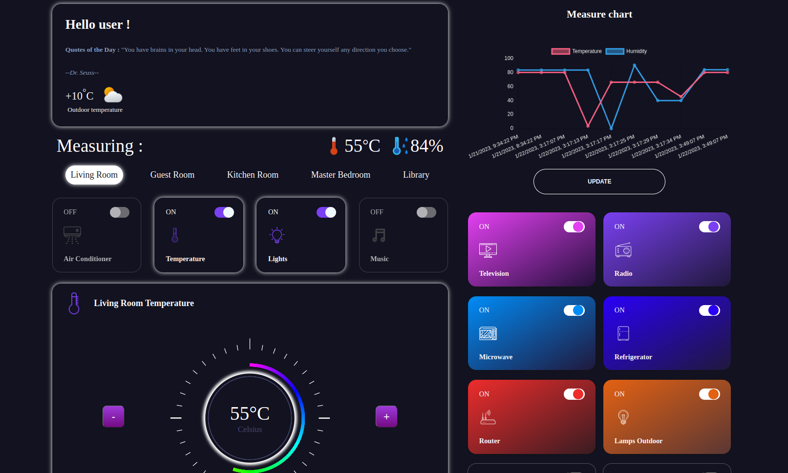
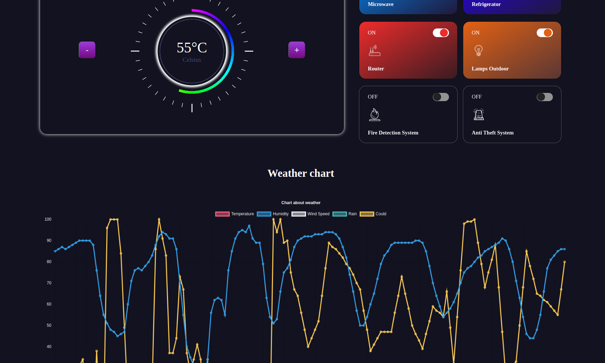
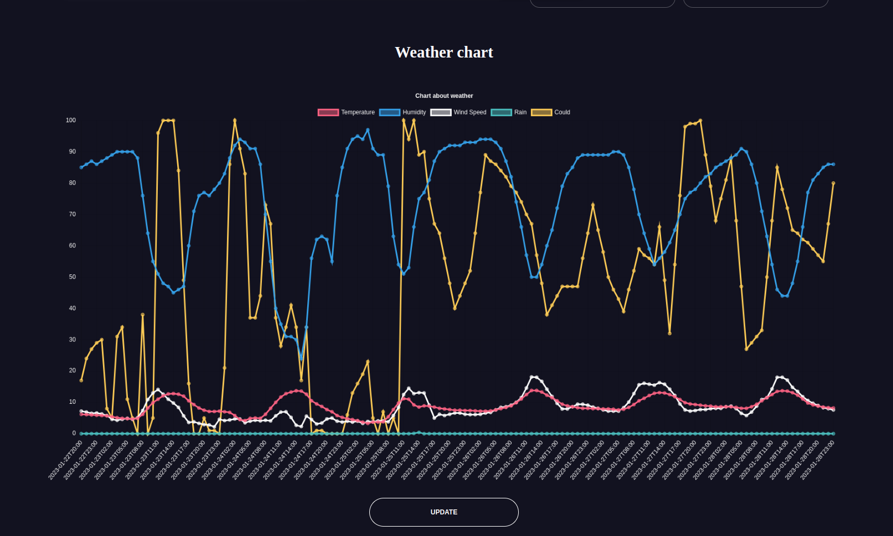
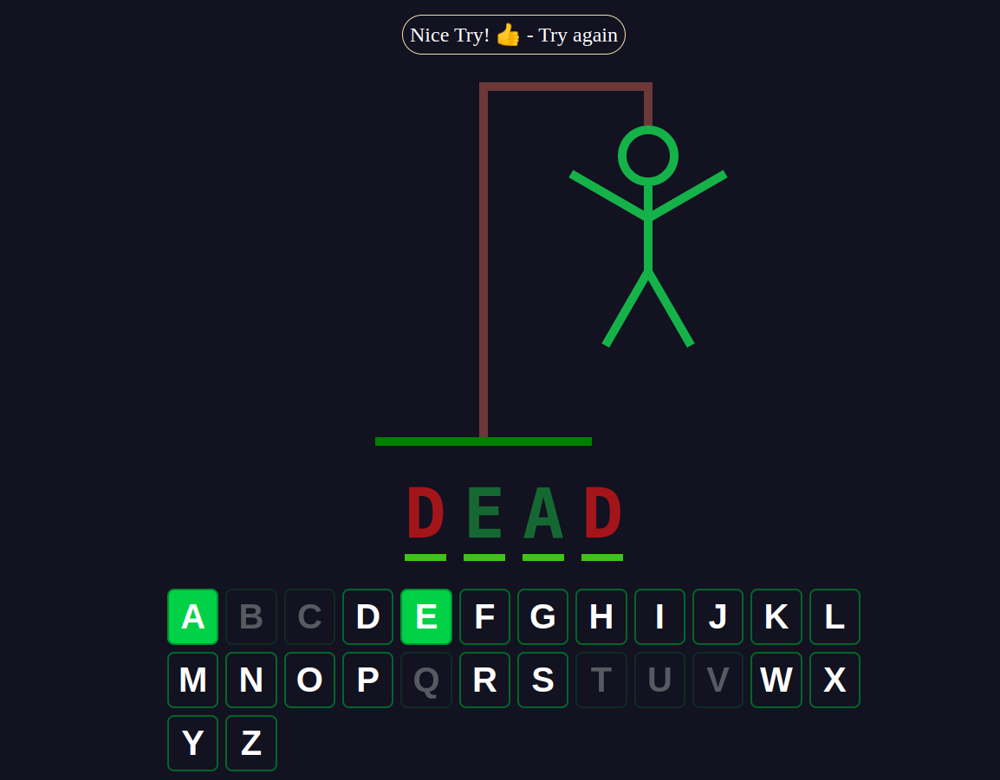

# MERN + ESP32 Smart Home Dashboard

Welcome to the MERN + ESP32 Smart Home Dashboard project! This project combines the power of the MERN stack (MongoDB, Express.js, React, Node.js) with ESP32 micro-controllers to create a comprehensive smart home dashboard.

## Screenshots





## Features

- Monitor and control various devices within your smart home remotely.
- Real-time updates on temperature, humidity, and device statuses.
- Interactive dashboard for managing room details and device statuses.
- MQTT integration for efficient communication between devices and the server.
- Database storage for historical data and analytics.

## Getting Started

### Prerequisites

- Node.js and npm (Node Package Manager)
- MongoDB (for server database)
- ESP32 micro-controllers (for IoT devices)

### Installation

1. Clone the repository:

   ```bash
   git clone https://github.com/NassimBenNsib/SmartHomeDashboard-MERN-ESP32.git
   cd SmartHomeDashboard-MERN-ESP32
    ```

2.  Install server dependencies: `cd server` && `npm install`
3.  Server Configuration 
    -   Update mqtt_broker_config.js with your MQTT broker details.
    -   Configure database_setup.js with your MongoDB URI.
    -   Customize structure.js for your house details.
4.  Start the server: `npm start`
5.  Install client dependencies: `cd ../client` && `npm install`
6.  Client Configuration 
    -   Update apis.config.js with your apis details.
    -   Update weather.config.js with your OpenWeather details.
7.  Start the client: `npm start`

## Usage
1.  Access the dashboard by navigating to http://localhost:3000 in your browser.
2.  View real-time updates, control devices, and manage room details.
3.  ESP32 devices can communicate with the server using MQTT.

## Contributing

Contributions are welcome! If you find bugs or want to add new features, please follow these steps:

1.  Fork the repository.
2.  Create a new branch: git checkout -b feature-name
3.  Commit your changes: git commit -m 'Add some feature'
4.  Push to the branch: git push origin feature-name
5.  Submit a pull request.

## License

This project is licensed under the [MIT License](LICENSE).

## Acknowledgments

This project was inspired by the need for a comprehensive smart home solution.
Thanks to the open-source community for their invaluable contributions.

## Contact

For questions or inquiries, contact [nassim.bennsib@gmail.com](mailto:nassim.bennsib@gmail.com).
